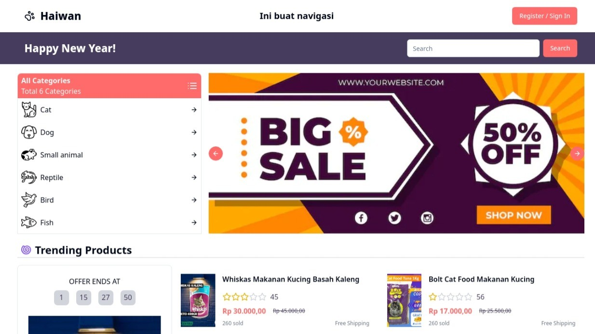
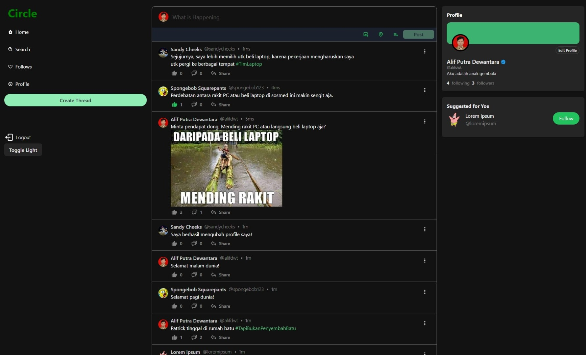
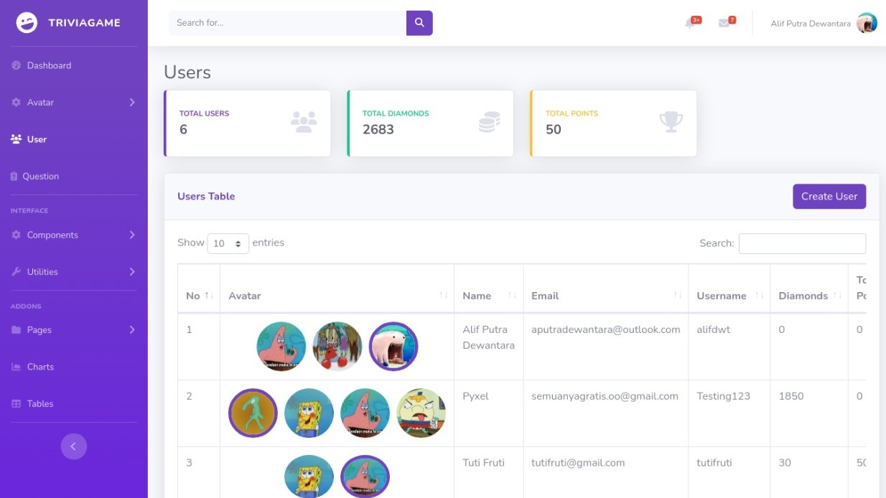
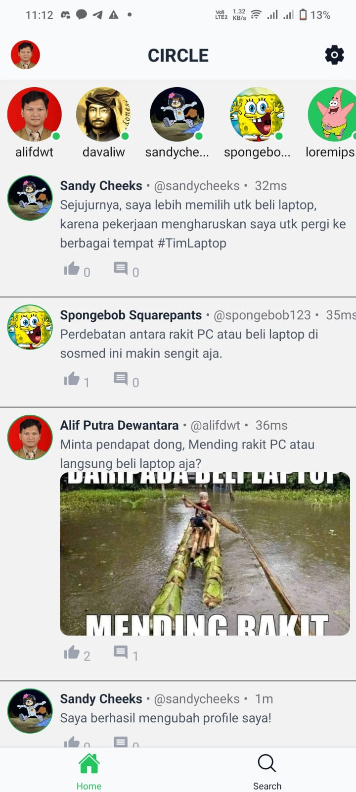
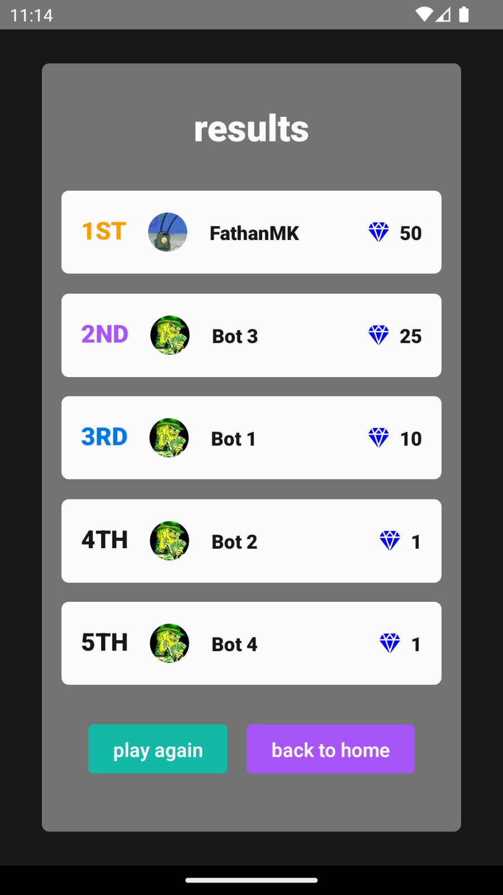

   
  
  
  
  

# Hi there

- 👨 Name: [Alif Dewantara](https://github.com/alifdwt)
- 🖥️ Coding: TypeScript (mostly), Javascript, Go, Python, and R
- 📚 Skills: Web Development, Machine Learning, Data Science, and Data Engineering
- ⚽ Hobby: Playing city builder games, listening to podcasts and exotic musics

If you want to know more about me, you can [follow me on Twitter](https://twitter.com/alifdwt), [check out my blog](https://alifdwt.github.io), or [view my GitHub profile](https://github.com/alifdwt), or [contact me via email](mailto:aputradewantara@gmail.com)

# Web Development Projects

    
     
    
    

# Mobile Development Projects

    
    

# Data Visualization Projects

    
     
    
    

